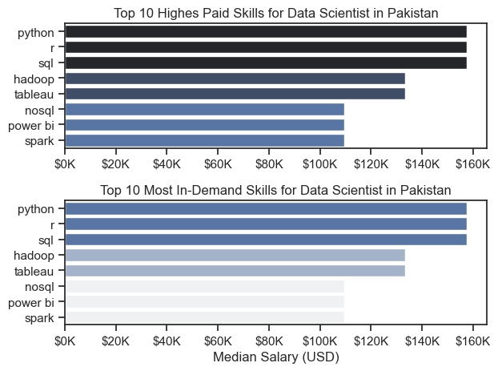

# OverView
Welcome to my analysis of the data job market, focusing on data Scientist roles. This project was created out of a desire to navigate and understand the job market more effectively. It delves into the top-paying and in-demand skills to help find optimal job opportunities for data Scientist In Pakistan. 

The data sourced from [Luke Barousse's](https://www.youtube.com/watch?v=wUSDVGivd-8&t=39099s) Python Course which provides a foundation for my analysis, containing detailed information on job titles, salaries, locations, and essential skills. Through a series of Python scripts, I explore key questions such as the most demanded skills, salary trends, and the intersection of demand and salary in data Science Jobs .


# The Questions
Below are the questions I want to answer in my project:
##### 1. What are the skills most in demand for the top 3 most popular data roles?
##### 2. How are in-demand skills trending for Data Scientist?
##### 3. How well do jobs and skills pay for Data Scientist?
##### 4. What are the optimal skills for data Scientist to learn? (High Demand AND High Paying)

# Tool Used
For my deep dive into the data Science job market, I harnessed the power of several key tools:

Python: The backbone of my analysis, allowing me to analyze the data and find critical insights.l also used the following Python libraries:

- Pandas Library: This was used to analyze the data.
- Matplotlib Library: I visualized the data.
- Seaborn Library: Helped me create more advanced visuals.
- Jupyter Notebooks: The tool I used to run my Python scripts which let me easily include my notes and analysis.
- Visual Studio Code: My go-to for executing my Python scripts.
* Git & Github:Essential for verision control and sharing my python code and analysis.


# Data Preparation and Cleanup

This section outlines the Steps taken to prepare the data for analysis, ensuring accuracy and usability.


# The Analysis
Each Jupyter notebook for this project aimed at investigating specific aspects of the data job market. Here's how I approached each question:

## 1. What are the most demanded skills for the top 3 most popular data roles?

To find the top most demanded skills for the top 3 most popular data roles . I filtered out those positions by which ones were the most Popular, and got top  5 skills for these 3 roles . this query highlights the most popular job titles and their top skills , showing which skills I should pay attention to depending on the role I'm targeting. 

View my notebook with detailed steps here: 
[2_skill_Demand.ipynb](3_Project\2_Skill_Demand.ipynb)

### Visualize Data

```python
fig, ax =plt.subplots(len(job_titles), 1)


for i , job_title in enumerate(job_titles):
    df_plot=df_skills_perc[df_skills_perc['job_title_short']== job_title].head(5)
    sns.barplot(data=df_plot, x='skill_percent' , y='job_skills', ax=ax[i], hue='skill_count', palette='dark:b_r')
    
plt.show()

```

### Results


### Insights

- Python is a must-have skill across all roles, particularly for Machine Learning Engineers.
- SQL is crucial for both Data Engineers and Data Scientists.
- Specific tools like AWS for Data Engineers, R for Data Scientists, and TensorFlow/PyTorch for Machine Learning Engineers add significant value.


## 2. How are in-demand skills trending for data Scientist?

```python
df_plot_pak=df_DS_Pak_percent.iloc[: , :5]

sns.lineplot(data=df_plot_pak, dashes=False , palette='tab10')


from matplotlib.ticker import PercentFormatter
ax=plt.gca()
ax.yaxis.set_major_formatter(PercentFormatter(decimals=0))


plt.show()

```
### Results


*Line graph Visualizing the trending top skills for Data Scientist in Pakistan in 2023*


### Insights:

- **Python**: Consistently the most in-demand skill, peaking multiple times throughout the year.
- **SQL**: Another highly sought-after skill, with consistent demand that peaks around November and March.
- **R**: Shows moderate demand, with notable fluctuations, especially between June and August.
- **Hadoop**: Experiences a significant decline in demand, especially from May to August, with brief recoveries.
- **Tableau**: Least demanded skill among the top 5, with very low demand throughout the year and a notable drop after February.

This graph highlights the fluctuating demand for these key skills, with Python and SQL being consistently dominant throughout the year.


## 3. How well do jobs and skills pay for Data Scientist?

### Summary: Salary Insights for Data Scientists in Pakistan

- **Median Salary**: Approximately PKR 1,391,600 ($150,000) annually.
- **Salary Range**: From PKR 812,900 to PKR 2,281,800, indicating substantial potential for higher earnings.
- **Experience Impact**: Salaries increase with experience; early-career Data Scientists (1-4 years) earn around PKR 1,005,560 on average.
- **Market Consistency**: The salary distribution is relatively narrow, suggesting consistent pay levels compared to other tech roles.


### Salary Analysis for Data Scientists


#### Visulizing Data

```python

sns.boxplot(data=df_pak_top6, x='salary_year_avg', y='job_title_short',order=job_order)


ax=plt.gca()
ax.xaxis.set_major_formatter(plt.FuncFormatter(lambda x, pos: f'${int(x/1000)}K'))
plt.xlim(0,300000)
plt.show()
```

### Results


*Box plot Visualizing the Salary Distribution for the top 6 Data Jobs titles.*

#### Insights


- **Data Scientist**:
  - Median salary is high, close to $150K.
  - The salary range is relatively narrow compared to some other roles, indicating more consistent pay.

- **Data Engineer**:
  - Median salary is slightly below $100K.
  - The salary range is broader, indicating more variability in pay. Some Data Engineers earn significantly more than others.

- **Data Analyst**:
  - Median salary is around $50K.
  - The range is narrow, suggesting less variability in salary for this role compared to Data Scientists and Engineers.

- **Machine Learning Engineer**:
  - This role shows the widest range in salary distribution, from around $50K to just under $250K.
  - The median salary is around $100K, but the broad range suggests that some Machine Learning Engineers can earn significantly more.

- **Software Engineer**:
  - Median salary is just below $50K.
  - The range is small, indicating consistent salary levels across the role.

- **Business Analyst**:
  - The lowest median salary, close to $50K.
  - Similar to Data Analyst, the range is narrow, indicating consistent salary levels across the role.


### Highest Paid and Most In-demand Skills for Data Scientist in Pakistan.

### Visualize Data

```python
fig, ax=plt.subplots(2,1)

sns.set_theme(style='ticks')

#Top 10 Highest paid Skills for Data Scientist
sns.barplot(data=df_DS_top_pay ,x='median', y=df_DS_top_pay.index, ax=ax[0], hue='median', palette='dark:b_r')


# Top 10 Most In-demand skills for Data Scientist
sns.barplot(data=df_DS_skills,x='median' ,y=df_DS_skills.index, ax=ax[1], hue="median" ,palette='light:b')


plt.show()

```


## Insights

Here are the insights from the provided image showing two bar plots that compare the highest-paid and most in-demand skills for Data Scientists in Pakistan:

### Top 10 Highest Paid Skills for Data Scientists in Pakistan:
- **Python** and **R** are the highest-paid skills, with median salaries close to $150K.
- **SQL** is slightly less but still commands a high median salary, just below $150K.
- **Hadoop** and **Tableau** follow, with median salaries around $120K.
- **NoSQL**, **Power BI**, and **Spark** are also valuable but have slightly lower median salaries compared to the top skills, ranging between $100K and $120K.

### Top 10 Most In-Demand Skills for Data Scientists in Pakistan:
- **Python** and **R** are not only the highest-paid but also the most in-demand skills, reflecting their importance in the industry.
- **SQL** also remains highly in demand, close to Python and R in terms of median salary.
- **Hadoop** and **Tableau** are still in demand but offer slightly lower salaries.
- **NoSQL**, **Power BI**, and **Spark** appear to be in demand but with lower salary levels, indicating they may be important but less valued compared to the top skills.


### Results


*Barplot visualizing Highest Salary and Demand Of Skills in Pakistan for Data Scientists.*


## 4. What is the most optimal skill to learn for Data Scientist?

### Visualize Data 

```python
from adjustText import adjust_text

#df_plot.plot(kind='scatter' , x='skill_percent' , y='median_salary')

sns.scatterplot(
   data=df_plot,
   x='skill_percent',
   y='median_salary',
   hue="technology"
)

plt.show()

```

### Results


*A scatter plot Visualizing the most optimal skills (High paying & High demand ) for Data Scientist in Pakistan.*

### Insights:

- **Python and SQL Dominance**:
  - Python and SQL are the most in-demand skills for data scientists in Pakistan, as they have the highest percentages of job postings that require these skills.
  - These skills also command higher median yearly salaries compared to other skills in the market.

- **High Demand for Analytical Tools**:
  - Analytical tools like Hadoop and Tableau are also in high demand, as indicated by their positions on the plot with a relatively high percentage of job postings.
  - These tools offer competitive salaries, although slightly lower than Python and SQL.

- **Relatively Lower Salaries for Other Skills**:
  - Skills like Power BI and other technologies appear on the lower end of both demand and salary spectrum, indicating that while these skills are required, they are less frequently sought after and are associated with lower median salaries.

- **Clear Skill Segmentation**:
  - There is a clear segmentation of skills, where programming languages (Python and SQL) are highly valued in terms of both demand and compensation, whereas some technologies and libraries are less valued.

- **Opportunity for Skill Development**:
  - Data scientists aiming to maximize their earnings and job opportunities should focus on mastering Python, SQL, and key analytical tools like Hadoop and Tableau.


## What I learned 
Throughout this project, I deepened my understanding of the data Scientists job market and enhanced my technical skills in Python,especially in data manipulation and visualization. Here are a few specific things I learned:

• Advanced Python Usage: Utilizing libraries such as Pandas for data manipulation, Seaborn and Matplotlib for data visualization,and other libraries helped me perform complex data analysis tasks more efficiently.
• Data Cleaning Importance: I learned that thorough data cleaning and preparation are crucial before any analysis can be conducted, ensuring the accuracy of insights derived from the data.
• Strategic Skill Analysis: The project emphasized the importance of aligning one's skills with market demand. Understanding the relationship between skill demand, salary, and job availability allows for more strategic career planning in the tech industry.


## Challenges I Faced in This Project

Embarking on my first project in Python and data analysis presented a range of challenges that tested my problem-solving skills and deepened my understanding of the field:

1. **Learning Curve with Python and Data Analysis**:
   - As this was my first project utilizing Python for data analysis, I had to quickly familiarize myself with various libraries such as Pandas, Matplotlib, and Seaborn. Understanding how to manipulate data, perform calculations, and generate meaningful visualizations was both challenging and rewarding.

2. **Handling Data Inconsistencies**:
   - The dataset I worked with contained inconsistencies such as missing values, varying formats, and potential outliers. Cleaning and preprocessing the data required careful attention to detail to ensure the final analysis was accurate and reliable. This process taught me the importance of data quality in analysis.

3. **Complex Data Visualization**:
   - Creating effective visualizations that clearly communicated insights was another significant challenge. I had to learn how to use visualization tools effectively, which involved not only plotting data but also customizing and refining the plots to avoid issues like overlapping labels and cluttered visuals. The process of making adjustments and iterating on visual design helped me appreciate the art and science of data visualization.

4. **Debugging and Troubleshooting**:
   - Throughout the project, I encountered numerous errors and unexpected results, which required persistent debugging and troubleshooting. This experience emphasized the importance of attention to detail and systematic problem-solving when working with code and data.

5. **Time Management**:
   - Balancing the demands of learning new tools, handling data inconsistencies, and creating complex visualizations while adhering to project deadlines was challenging. I had to prioritize tasks effectively and manage my time efficiently to complete the project on time.

Despite these challenges, this project has been an invaluable learning experience. It provided me with practical exposure to real-world data analysis, and I am now more confident in my ability to tackle similar projects in the future.

# Conclusion

This exploration into the data Science job market has been incredibly informative, highlighting the critical skills and trends that shape this evolving field. The insights I got enhance my understanding and provide actionable guidance for anyone looking to advance their career in data Science. As the market continues to change, ongoing analysis will be essential to stay ahead in data science. This project is a good foundation for future explorations and underscores the importance of continuous learning and adaptation in the data field.